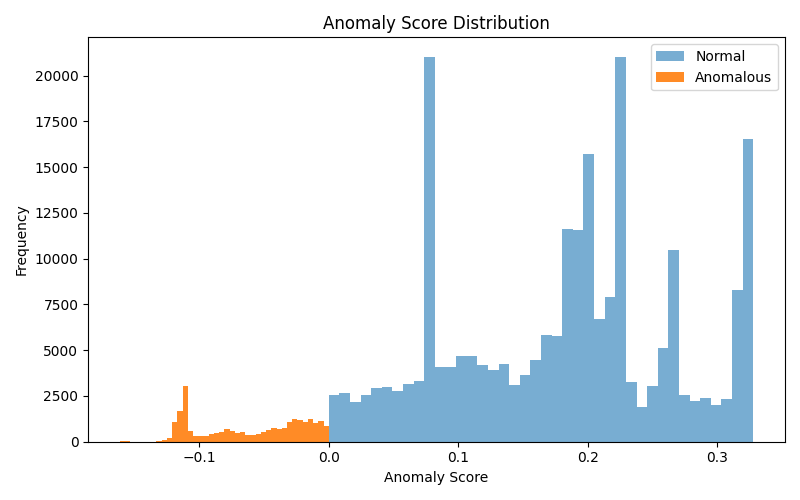
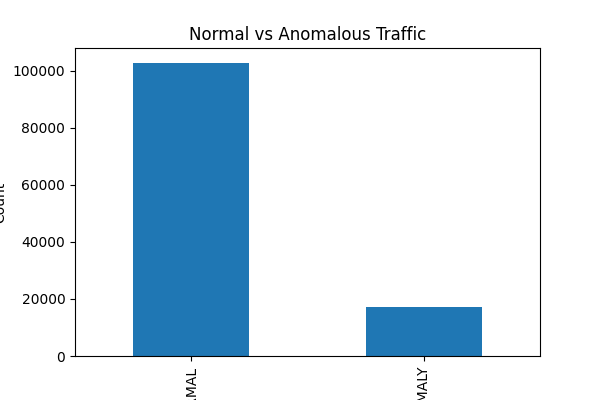
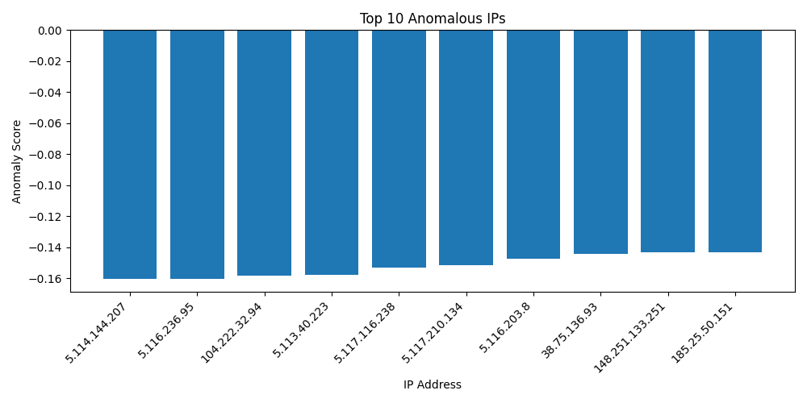

# Web Log Anomaly Detection using Unsupervised AI

This project implements an **AI-based intrusion detection system** that analyses **web server access logs** and detects anomalous or suspicious behaviour using **unsupervised machine learning**.  
The system processes raw access logs, extracts meaningful features, trains an Isolation Forest model, and provides results through a **FastAPI backend** and a **React + Tailwind frontend**.

The project is designed to be **beginner-friendly**, modular, and suitable for **academic coursework (MSc Cyber Security & AI)**.

## Dataset

Due to GitHub file size limits, the full access log dataset is not included in this repository.

### Sample Data

A small sample log file is provided for demonstration:

- `data/raw/access_sample.log`

### Full Dataset

The complete access log file can be downloaded from:
[Download Full Dataset](https://www.kaggle.com/datasets/eliasdabbas/web-server-access-logs)

After downloading:

1. Place `access.log` inside `data/raw/`
2. Run the preprocessing script to generate features

---

## 📌 Project Objectives

- Parse raw web server access logs into structured data
- Extract behavioural features from web traffic
- Train an **unsupervised anomaly detection model**
- Detect suspicious IP behaviour without labelled attack data
- Visualise anomaly results using charts
- Provide a simple web interface for CSV upload and analysis
- Trigger email alerts when anomalies are detected (optional)

---

## 🧠 Why Unsupervised Learning?

In real-world scenarios, labelled attack data is often unavailable or outdated.  
This project uses **Isolation Forest**, an unsupervised algorithm that:

- Learns normal traffic behaviour
- Flags deviations as anomalies
- Does not require predefined attack signatures

---

## 📂 Project Structure

web-log-anomaly-detection/
│
├── api/
│ ├── main.py
│ ├── detector.py
│ ├── upload_detect.py
│ ├── charts.py
│ └── email_alert.py
│
├── src/
│ ├── prepare.py
│ ├── feature_engineering.py
│ ├── train.py
│ ├── predict.py
│ ├── baseline_filter.py # optional
│ └── simulate_attack.py
│
├── data/
│ ├── raw/
│ │ └── access.log
│ └── processed/
│ ├── parsed_logs.csv
│ ├── features.csv
│ └── features_with_attack.csv
│
├── models/
│ └── isolation_forest.pkl
│
├── logs/
│ └── predictions.json
│
├── temp/
│ └── charts/
│
├── frontend/
│ └── (React + Tailwind app)
│
├── .env
├── requirements.txt
└── README.md

---

## 🔄 Project Workflow (High Level)

1. **Prepare Logs**

   - `prepare.py`: access.log → parsed_logs.csv

2. **Feature Engineering**

   - `feature_engineering.py`: parsed logs → numerical features

3. **Model Training**

   - `train.py`: features → Isolation Forest model

4. **Prediction**

   - `predict.py`: features + model → anomaly results

5. **API Layer**

   - FastAPI serves detection, upload, charts, and alerts

6. **Frontend**
   - React UI uploads CSV and displays results & charts

---

## ⚙️ Installation & Setup

### 1️⃣ Create Virtual Environment

```bash
python -m venv venv
```

root terminal -> web-log-anomaly-detection/

Activate first in root terminal

```bash
venv\Scripts\Activate.ps1
```

Install Dependencies in root terminal

```bash
pip install -r requirements.txt
```

**Add Dataset**

- Place your web server log file here:
  data/raw/access.log

🚀 **Running the Pipeline**

- Step 1: Parse Logs
  python src/prepare.py

- Step 2: Feature Engineering
  python src/feature_engineering.py

- Step 3: Train Model
  python src/train.py

- Step 4: Predict Anomalies
  python src/predict.py

🌐 **Running the Backend (FastAPI)**

- uvicorn api.main:app --reload

**Open Swagger UI:**

- http://127.0.0.1:8000/docs

**Available endpoints:**

- POST /detect

- POST /detect-upload

- GET /charts/\*

💻 **Setting up and Running the Frontend (React)**

```bash
npm create vite@latest frontend
```w

```bash
cd frontend
npm install
npm run dev
```

Frontend runs at:

- http://localhost:5173

📊 Visualisations

The system generates:

- Anomaly score distribution

- Normal vs anomalous traffic count

- Top anomalous IP addresses

- Charts are saved in:

temp/charts/

📸 Example Charts





📧 Email Alerts (Optional)

Create a .env file:

- GMAIL_USER=yourgmail@gmail.com
- GMAIL_APP_PASSWORD=your_gmail_app_password
- ALERT_TO_EMAIL=receiver@gmail.com

Email alerts are triggered when anomalies are detected.

🧪 Testing the System

- Upload a CSV containing web traffic features

- System detects anomalies using the trained model

- Results and charts are displayed in the UI

- Email alert is sent (if configured)

🎓 Academic Notes

- No labelled attack data is required

- Artificial anomalies are only used for testing

- Evaluation is performed using anomaly score analysis and visualisation

- Designed to meet MSc Level 7 coursework requirements

📌 Technologies Used

- Python

- Pandas, NumPy

- Scikit-learn (Isolation Forest)

- FastAPI

- React.js

- Tailwind CSS

- Matplotlib

✅ Conclusion

This project demonstrates how unsupervised AI techniques can be effectively applied to cybersecurity log analysis.
It provides a complete pipeline from raw logs to detection, visualisation, and alerting, using real-world data and beginner-friendly tools.

👤 Author

**Rabi Giri**
**MSc IT (Cyber Security & AI)**
**London Metropolitan University • Islington College**
